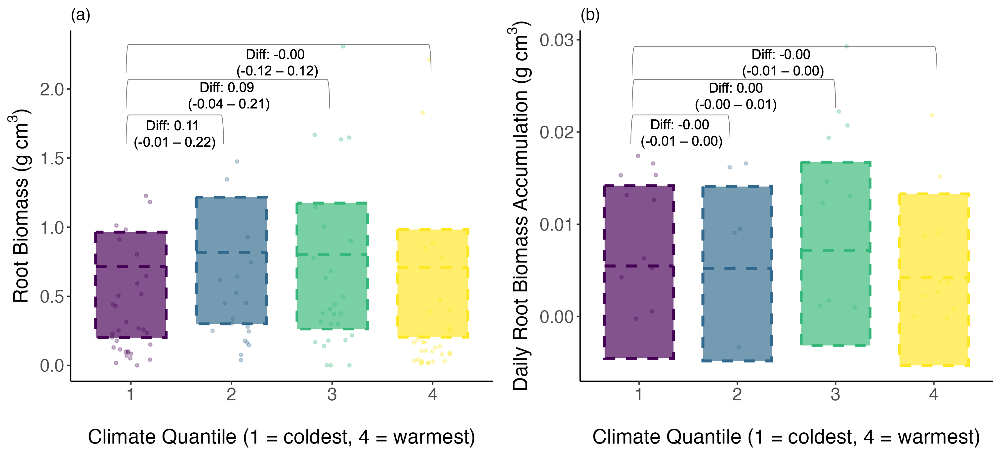
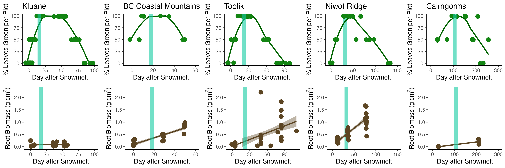
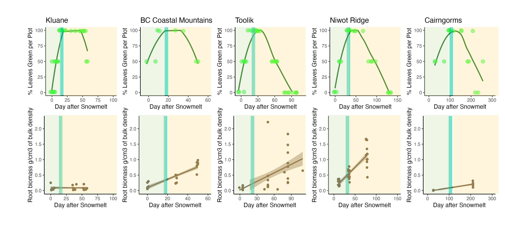
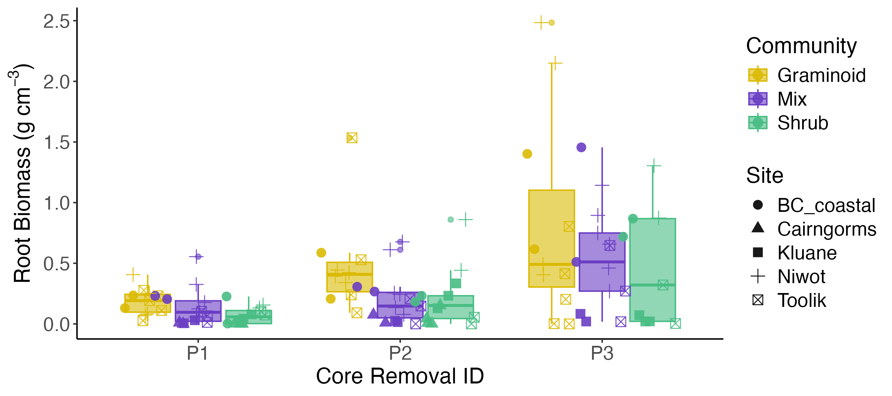
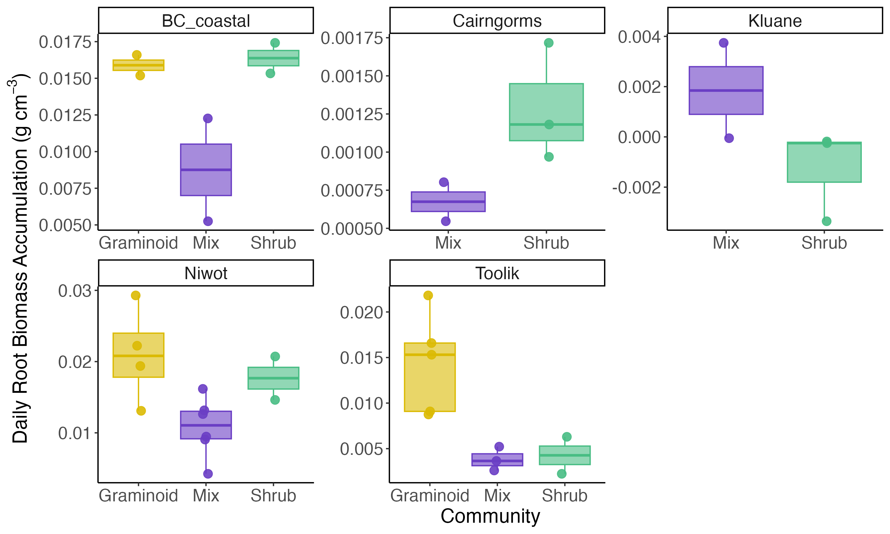
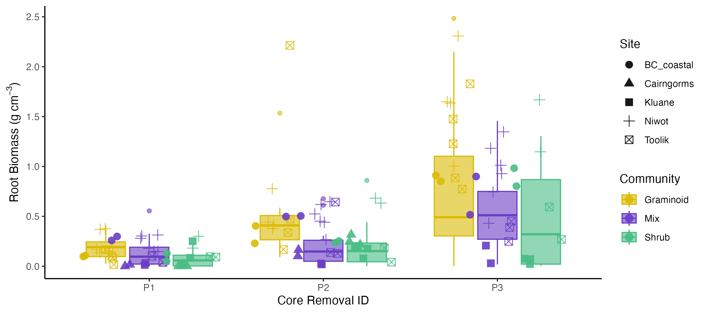
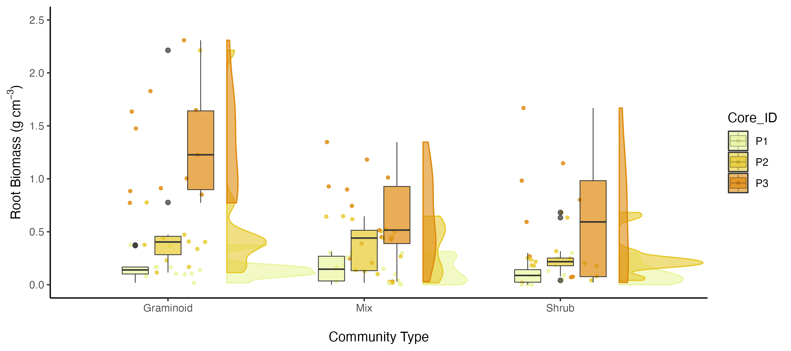
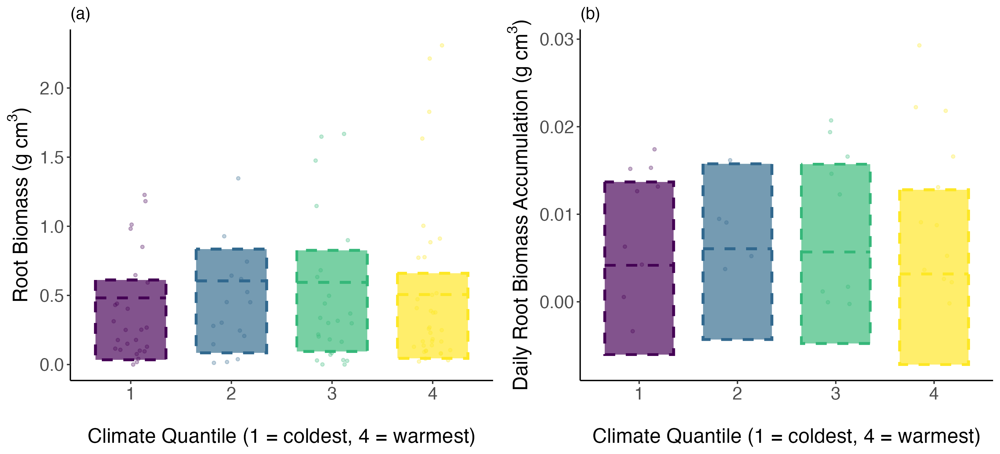
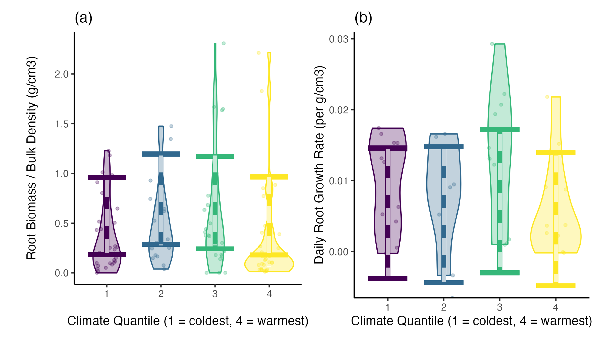

# Above vs Below-Ground Phenology: Visual Analysis

This document showcases the key figures from the research project "Tundra vegetation community, not microclimate, controls asynchrony of above and belowground phenology". The study examines the temporal patterns of above-ground leaf and below-ground root growth across multiple tundra sites.

## Research Overview

The below-ground growing season often extends beyond the above-ground growing season in tundra ecosystems. This research investigates where and when this occurs and whether these phenological asynchronies are driven by variation in local vegetation communities or by spatial variation in microclimate.

**Study Sites:** Five sites across the tundra biome  
**Key Finding:** Asynchronous growth between above-ground and below-ground plant tissue, with the below-ground season extending up to 74% beyond the onset of above-ground leaf senescence.

## Table of Contents

1. [Key Research Figures](#key-research-figures) - Main manuscript figures
2. [Site Comparison and Data Analysis](#site-comparison-and-data-analysis) - Phenocam vs root data
3. [Community Analysis](#community-analysis) - Vegetation community comparisons
4. [Biomass and Environmental Relationships](#biomass-and-environmental-relationships)
5. [Statistical Modeling Results](#statistical-modeling-results) - Quantile regression analysis
6. [Site Characterization](#site-characterization) - PCA analysis
7. [Research Implications](#research-implications) - Key findings and significance

---

## Key Research Figures

### Figure 3: Main Research Findings

*This figure presents the core findings of the study, showing the comparison between above-ground and below-ground phenology patterns across different tundra sites and vegetation communities.*

### Figure 4: Community and Environmental Controls

*Figure 4 demonstrates how plant community type, rather than microclimate, acts as the primary control on the timing, productivity, and growth rates of roots.*

---

## Site Comparison and Data Analysis

### Phenocam vs Root Growth Comparison

*Comparison between phenocam-derived above-ground greenness data and measured root growth patterns, showing the temporal asynchrony between above- and below-ground growth.*

### Camera vs Root Data Comparison

*Detailed comparison between camera-based vegetation monitoring and direct root biomass measurements across different time periods.*

---

## Community Analysis

### Alternative Community Analysis

*Analysis of different vegetation community types (graminoid, shrub, and mixed communities) and their distinct phenological patterns.*

### Community Growth Rates

*Comparison of root growth rates across different plant community types, highlighting the distinct 'pulse' of graminoid root growth later in the growing season.*

### Top 5 Alternative Community Analysis

*Focused analysis on the five most distinct community responses, showing clearer patterns in phenological timing differences.*

---

## Biomass and Environmental Relationships

### Biomass by Community Type

*Root biomass accumulation patterns across different vegetation community types, demonstrating how community composition influences below-ground productivity.*

---

## Statistical Modeling Results

### Quantile Regression Analysis

*Bayesian regression model results showing the relationship between microclimate conditions (represented as temperature quantiles) and root growth patterns.*

### Quantile Panel Analysis

*Comprehensive panel analysis examining how different quantiles of environmental conditions affect root growth across multiple sites and community types.*

---

## Site Characterization

### Principal Component Analysis of Sites

*Principal Component Analysis showing how the different study sites cluster based on their environmental and vegetation characteristics.*

---

## Research Implications

This comprehensive analysis reveals that:

1. **Community Control**: Plant community type, rather than microclimate, is the primary driver of phenological asynchrony
2. **Extended Growth**: Below-ground growth continues well beyond above-ground senescence
3. **Species Differences**: Graminoid roots show distinct late-season growth pulses compared to shrub roots
4. **Climate Implications**: As the climate warms and vegetation changes, these patterns may significantly impact below-ground carbon storage

## Data and Methods

The research combines:
- **Phenocam data**: Automated camera monitoring of above-ground vegetation
- **Root biomass measurements**: Direct sampling of root growth at multiple time points
- **Microclimate monitoring**: Temperature and soil condition measurements
- **Community classification**: Vegetation type characterization across study sites
- **Statistical modeling**: Bayesian regression and quantile analysis

---

*For more details, see the full manuscript pre-print: https://ecoevorxiv.org/repository/view/7299/*

## Authors
Elise Gallois, Isla H. Myers-Smith, Colleen M. Iversen, Verity Salmon, Laura Turner, Ruby An, Sarah C. Elmendorf, Courtney Collins, Madelaine Anderson, Amanda Young, Lisa Pilkinton, Gesche Blume-Werry, Maude Grenier, Geerte Fälthammar de Jong, Inge H.J. Althuizen, Casper T. Christiansen, Simone I. Lang, Cassandra Elphinstone, Greg H.R. Henry, Nicola Rammell, Michelle Mack, Craig See, Christian Rixen, Robert D. Hollister